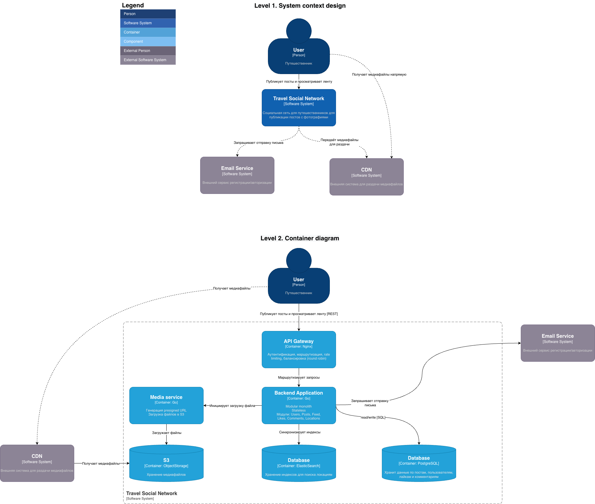

# social_network_system_design
System Design социальной сети для курса по System Design

## Постановка задачи

У бизнеса **есть четкое понимание функциональности**, которая эта социальная сеть должна будет предоставлять в будущем:

- публикация постов из путешествий с фотографиями, небольшим описанием и привязкой к конкретному месту путешествия;
- оценка и комментарии постов других путешественников;
- подписка на других путешественников, чтобы следить за их активностью;
- поиск популярных мест для путешествий и просмотр постов с этих мест;
- просмотр ленты других путешественников и ленты пользователя, основанной на подписках в обратном хронологическом порядке;

> Что касается будущей аудитории социальной сети - у бизнеса есть огромные средства для рекламы и продвижения социальной сети, поэтому пользовательская база будет постепенно линейно расти и предполагается, что через год достигнет примерно 10 000 000 уникальных пользователей в день, после чего также будет продолжать расти. Бизнес пока нацелен  только на аудиторию стран СНГ (*на зарубежный рынок выходить планов нет*). Будущая система должна быть очень надежной, а также, чтобы с ней было удобно взаимодействовать, используя мобильные устройства и браузер.

Исходя из всего этого, в этой части домашнем задания нужно **формализовать функциональные и нефункциональные требования к будущей системе**, используя полученную информацию от бизнеса, анализ конкурентов и ваш собственный инженерный и пользовательский опыт. После этого, нужно будет примерно **оценить нагрузку** (RPS и трафик) на будущую систему. **Оценку нагрузки рекомендуется проводить в разрезе по подсистемам** (*посты, реакции, комментарии*) вашей будущей системы.

## Описание решения 

### Ограничения
- Все профили являются публичными.
- Лента пользователей состоит только из публикаций пользователей, на которых он подписан, без рекоммендаций.
- В один пост можно выложить до 20 фотографий.
- Популярность места определяется по количеству постов, в которых указано данное место.
- Ограничения по размеру и формату изображений находятся за рамками текущего этапа.
- Восстановление пароля будет реализовано за рамками текущего этапа.
- Регистрация с помощью других способов будет реализована за рамками текущего этапа.
- Поддержка языков, кроме русского, будет реализована за рамками текущего этапа.

### Функциональные требования

- Cистема должна давать возможность создать профиль пользователя с фотографией, описанием и ником.
- Cистема должна давать возможность отредактировать профиль пользователя: изменить фотографию, ник или описание.
- Cистема должна давать возможность удалить профиль пользователя.
- Cистема должна обеспечить возможность опубликовать пост с фотографиями, текстовым описанием и указанием геолокации.
- Система должна обеспечить возможность отредактировать пост: изменить описание, добавить/удалить фотографию и изменить локацию.
- Система должна обеспечить возможность удалить пост.
- Система должна давать возможность просматривать все свои публикации в профиле в формате ленты, отсортированной в обратном хронологическом порядке.
- Система должна давать возможность просмотреть профиль другого пользователя в формате ленты, отсортированной в обратном хронологическом порядке.
- Cистема должна предоставить возможность подписываться на других пользователей, чтобы следить за их активностью.
- Cистема должна предоставить возможность просмотреть список своих подписок.
- Cистема должна предоставить возможность просмотреть список своих подписчиков.
- Cистема должна предоставить возможность отменить подписку на пользователя.
- Cистема должна отображать ленту пользователя, основанную на его подписках и отсортированную в обратном хронологическом порядке.
- Cистема должна предоставить возможность оценивать посты других пользователей: не больше одного лайка на публикацию.
- Cистема должна предоставить возможность убирать лайки с постов других пользователей.
- Cистема должна предоставить возможность просматривать, кто оценил пост.
- Cистема должна предоставить возможность комментировать посты других пользователей.
- Cистема должна предоставить возможность удалять комментарии автору поста и автору комментария.
- Cистема должна предоставить возможность просматривать комментарии других пользователей.
- Система должна предоставлять возможность искать по локации и отображать все посты, сделанные в этой локации.
- Система должна собирать статистику о количестве постов, привязанных к каждой локации и формировать список популярных мест для путешествий.
- Система должна предоставлять возможность искать популярные места и отображать все посты, сделанные в этих локациях.
- Cистема позволяет авторизоваться с помощью логина и пароля.
- Система должна обеспечить регистрацию пользователя с помощью email.

### Нефункциональные требования 

#### Производительность (Performance)

- Система должна выдерживать нагрузку, соответствующую 10 000 000 уникальных пользователей в день (DAU).
- Система должна обеспечивать стабильную работу при линейном росте аудитории после первого года.
- Среднее время ответа API не должно превышать 200 мс при типовой нагрузке.
- Основные пользовательские сценарии (лента, просмотр профиля, публикация постов) должны выполняться не дольше 1 секунды при стабильном соединении.
- Система должна поддерживать высокую пропускную способность для чтения, соответствующую потребностям социальной сети (построение ленты, просмотр профилей, комментарии).

#### Масштабируемость (Scalability)

- Система должна поддерживать горизонтальное масштабирование всех stateless-сервисов.
- Архитектура должна поддерживать увеличение нагрузки на десятки миллионов DAU без переписывания основных компонентов.
- Система должна допускать независимое масштабирование подсистем (лента, посты, комментарии, поиск).
- Хранилище медиа должно быть спроектировано с учётом большого роста объёма данных (медиа-контент пользователей СНГ).

#### Надёжность и доступность (Reliability & Availability)

- Система должна быть доступна не менее чем 99.9% времени (SLA).
- Должны быть реализованы механизмы автоматического восстановления сервисов после сбоев.
- Данные пользователя (профиль, посты, лайки, комментарии) должны сохраняться с использованием многоуровневой репликации.
- Лента должна продолжать работать даже при частичном отказе подсистем (мягкая деградация).
- Система должна устойчиво выдерживать всплески нагрузки, связанные с ростом аудитории.

#### Безопасность (Security)

- Все данные должны передаваться по защищённому протоколу (HTTPS).
- Должна быть реализована защита от основных веб-угроз.
- Авторизация пользователей должна происходить по безопасным стандартам паролей.
- Должны быть механизмы ограничения частоты запросов (rate limiting).
- Пароли должны храниться в зашифрованном виде.

#### Удобство использования (Usability / UX)

- Система должна быть полностью доступна с мобильных устройств — адаптированный UI/UX или отдельное мобильное приложение.
- Интерфейс должен корректно работать в популярных браузерах (Chrome, Safari, Firefox, Edge).
- Время загрузки интерфейса должно позволять комфортную работу даже при среднем качестве мобильной сети (4G/3G).
- Фото и контент должны загружаться постепенно (lazy loading), чтобы обеспечить плавный UX.

#### Наблюдаемость (Observability)

- Система должна собирать метрики (RPS, latency, error rate, количество активных пользователей).
- Должно быть централизованное логирование ключевых операций.
- Должны быть настроены алерты на отклонения SLA и резкие всплески ошибок.
- Должна быть поддержка распределённых трассировок запросов (если используется микросервисная архитектура).

#### Поддерживаемость (Maintainability)

- Архитектура должна предусматривать возможность быстрого внесения изменений без остановки сервиса.
- Кодовая база должна быть модульной, чтобы разные команды могли работать над подсистемами независимо.
- Должны быть автотесты основных пользовательских сценариев.
- Документация должна поддерживаться в актуальном состоянии по мере роста системы.

#### Географическое покрытие

- Сервис должен быть оптимизирован под аудиторию стран СНГ.
- Вся локализация интерфейса — русская.

### Модель C4
Для проектирования архитектуры использована модель C4. Она позволяет описывать программную архитектуру на разных уровнях абстракции — от общего контекста системы до отдельных контейнеров. В проекте представлены два уровня: **Level 1 (System Context)** показывает систему и её взаимодействие с пользователями и внешними системами, **Level 2 (Container Diagram)** раскрывает внутреннюю структуру системы.


### Оценка нагрузки

Ниже приведён расчёт средней нагрузки (RPS) и трафика для системы на основе ожидаемой аудитории — **10 000 000 DAU**.

Оценка выполняется в разрезе подсистем:
- публикации постов;
- лайки (реакции);
- комментарии;
- лента;
- просмотр профилей / постов;
- поиск по локациям;

#### Допущения

| Метрика                                                    | Значение                                |
| ---------------------------------------------------------- | --------------------------------------- |
| Среднее количество просмотров ленты на пользователя в день | 20                                      |
| Среднее количество просмотров профилей / постов            | 5                                       |
| Среднее количество лайков на пользователя                  | 5                                       |
| Среднее количество комментариев на пользователя            | 1                                       |
| Среднее количество публикаций                              | 0.1 (1 пост на 10 пользователей в день) |
| Средний размер запроса                                     | 2 KB                                    |

#### Формулы
```
RPS = dau * avg_requests_per_day_by_user / 86 400
Traffic = rps * avg_request_size
```

#### Расчет нагрузки
##### Лента
```
RPS = 20 * 10 000 000 / 86400 ≈ 2315
Traffic = 2315 * 2 KB ≈ 4630 KB/s ≈ 4.5 MB/s
```
##### Профили
```
RPS = 5 * 10 000 000 / 86400 ≈ 579
Traffic = 579 * 2 KB ≈ 1158 KB/s ≈ 1.1 MB/s
```

##### Лайки (реакции)
```
RPS = 5 * 10 000 000 / 86400 ≈ 579
Traffic = 579 * 2 KB ≈ 1158 KB/s ≈ 1.1 MB/s
```

##### Комментарии
```
RPS = 1 * 10 000 000 / 86400 ≈ 116
Traffic = 116 * 2 KB ≈ 232 KB/s ≈ 0.23 MB/s
```

##### Публикация постов
```
RPS = 0,1 * 10 000 000 / 86400 ≈ 12
Traffic = 12 * 2 KB ≈ 24 KB/s ≈ 0.02 MB/s
```

##### Поиск по локациям
```
RPS = 1 * 10 000 000 / 86400 ≈ 116
Traffic = 116 * 2 KB ≈ 232 KB/s ≈ 0.23 MB/s
```

### Оценка дисков

#### Допущения

| Метрика                                                    | Значение                                |
| ---------------------------------------------------------- | --------------------------------------- |
| Среднее количество фото в посте                            | 2                                       |
| Средний размер фото                                        | 2 МБ                                    |
| Средний размер строки Likes (с индексами)                  | 100B                                    |
| Средний размер строки Сomments (с индексами)               | 200B                                    |
| Средний размер строки Posts (с индексами)                  | 1 КB                                    |
| Средний размер строки Posts_photos (с индексами)           | 100B                                    |
| Количество локаций в системе                               | 1 000 000                               |
| Средний размер одного документа в elasticsearch            | 5 КB                                    |    
| Средняя запись фото                                        | 45 МБ/с                                 |
| IOPS Object Storage                                        | 500                                     |  
| IOPS Postgresql                                            | 50 000                                  |
| IOPS Elasticsearсh                                         | 116                                     |


| Параметр                               | HDD         | SSD (SATA)   | SSD (NVMe)  |
|----------------------------------------|-------------|--------------|-------------|
| Объём                                  | до 32 ТБ    | до 100 ТБ    | до 30 ТБ    |
| Операции ввода-вывода в секунду (IOPS) | 100         | 1 000        | 10 000      |
| Пропускная способность                 | 100 МБ/с    | 500 МБ/с     | 3 ГБ/с      |

#### Расчет количества дисков

##### Object Storage
```
Сapacity = 10 000 000 * 0.1 * 2 * 2 МБ * 365 ≈ 1390 ТБ/год ≈ 1.36 ПБ/год + 30% (перезагрузки, разные форматы, служебное) ≈ 1770 ТБ/год
Disks_for_capacity = 1770 ТБ/ 32 ТБ ≈ 56 дисков
Disks_for_throughput = 45 МБ/с/100 МБ/с ≈ 1 диск
Disks_for_iops = 500 / 100 = 5 дисков
Disks = max(56, 1, 5) = 56
```

**Итого**: 56 HDD по 32 ТБ

##### PostgreSQL
**Лайки**
```
10 000 000 * 5 * 365 = 18.25 млрд лайков/год
Сapacity = 18.25 млрд * 100B ≈ 1.83 ТБ/год
```

**Комментарии**
```
10 000 000 * 1 * 365 = 3.65 млрд комментариев/год
Сapacity = 3.65 млрд * 200B ≈ 0.73 ТБ/год
```

**Посты**
```
10 000 000 * 0.1 * 365 = 365 млн постов/год
Сapacity = 365 млн * 1 KB ≈ 0.34 ТБ/год
```

**Фото**
```
10 000 000 * 0.1 * 2 * 365 = 730 млн строк/год
Сapacity = 730 млн * 100B ≈ 0.07 ТБ/год
```

**Суммарно** 

≈ 3.0 ТБ/год

Добавим запас на bloat/MVCC/WAL/рост (x2) ≈ 6 ТБ/год
```
Сapacity ≈ 6 ТБ/год
Disks_for_capacity = 6 ТБ/ 3.84 ТБ ≈ 2 диска
Disks_for_throughput = (4.5 + 1.1 + 1.1 + 0.23 + 0.02 + 0.23)МБ/с/3000 МБ/с ≈ 1 диск
Disks_for_iops = 50 000 / 10 000 = 5 дисков
Disks = max(2, 1, 5) = 5 дисков
```
**Итого**: 5 SSD NVMe по 3.84 ТБ


##### Elasticsearch 

1 000 000 * 5 KB ≈ 5 ГБ/год

Добавим запас (x2) ≈ 10 ГБ/год

```
Сapacity ≈ 10 ГБ/год
Disks_for_capacity = 0.01 ТБ/ 4 ТБ ≈ 1 диск
Disks_for_throughput =  0.23 МБ/с/500 МБ/с ≈ 1 диск
Disks_for_iops = 116 / 1000 = 1 диск
Disks = max(1, 1, 5) ≈ 1 диск
```
**Итого**: 1 SSD (SATA) по 4 ТБ

### Оценка хостов
#### Допущения

| Метрика                                                    | Значение                                |
| ---------------------------------------------------------- | --------------------------------------- |
| Дисков на хост PostgreSQL                                  | 1                                       |
| Дисков на хост Object Storage                              | 2                                       |
| Дисков на хост Elasticsearch                               | 1                                       |

#### Формулы
```
Hosts = disks / disks_per_host 
Hosts_with_replication = hosts * replication_factor
```

##### PostgreSQL
```
Hosts = 5 / 1 = 5
Hosts_with_replication = 5 * 3 = 15
```

##### Object Storage
```
Hosts = 56 / 2 = 28
Hosts_with_replication = 28 * 3 = 84
```

##### Elasticsearch
```
Hosts = 1 / 1 = 1
Hosts_with_replication = 1 * 1 = 1
```
